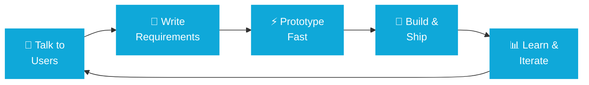

# Hey, I'm Omar 👋

### Product Owner | Builder | AI Enthusiast | HRTech Specialist

---

## 🎯 Kinderly

**Making caregiving less chaotic.**

[Visit Website →](https://kinderly.net)

| |  |
|---|---|
| **What it does** | Simplifying care management for families |
| **Where I'm at** | Product validation & user research |
| **The bet** | Millions need this. Most tools are terrible. |

---

## 🔄 How I Work (The Workflow)

---

## 🚀 What I'm Building

<table>
<tr>
<td width="50%">

### Kinderly
Core focus. Building product-market fit through relentless user research and rapid validation.

**Current:** Deep discovery phase

</td>
<td width="50%">

### HRTech Expertise
Years in HRMS, payroll, workforce planning. I understand what actually solves problems vs. what sounds good in a meeting.

**Experience:** Enterprise scale systems

</td>
</tr>
</table>

---

## 📚 What I'm Learning

| AI-Native Workflows | Founder Skills | Product Thinking |
|---|---|---|
| Claude + ChatGPT for actual work | Validation & MVP speed | When to trust data vs. intuition |
| Building faster without cutting corners | User feedback signals | Making decisions with incomplete info |
| Cursor for rapid prototyping | What to build vs. ignore | Why most products fail |

---

## 💼 How I Actually Think

<blockquote>

**Talk to users first** — Not surveys. Real conversations.

**Write clear specs** — Good requirements prevent a thousand bad conversations.

**Ship early** — Best learning comes from real usage, not theory.

**Measure what matters** — Not vanity metrics, real signals.

**Use AI where it helps** — Because it removes friction, not because it's cool.

</blockquote>

---

## 🛠️ Toolkit

**Product:** Jira • Confluence • Notion • Figma

**Building:** Claude • ChatGPT • Cursor • GitHub

**Data:** SQL • Mixpanel • Google Analytics • Postman

---

## 📊 GitHub Stats

---

## 💬 Let's Talk

**Interested in:**
- Building products people actually want
- HRTech & workforce problems worth solving
- AI in product workflows
- Early-stage founder challenges

**Get in touch:**

[LinkedIn](https://linkedin.com/in/omar-wafaey-087b42205/) • [Twitter](https://twitter.com/OmerWafaey) • [Email](mailto:omerwafaey@gmail.com)

---

